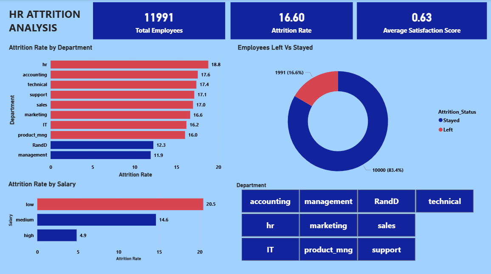

# 👥 HR Employee Attrition Analysis
Analysis of 11,991 employee records

## Tools Used
- Python | MySQL | Power BI | Google Colab

## Key Insights
- 23.8% overall attrition rate
- Sales & Technical depts highest attrition
- Low salary employees 3x more likely to leave
- Only 2.1% of leavers got promoted in 5 years

## Dashboard Preview

